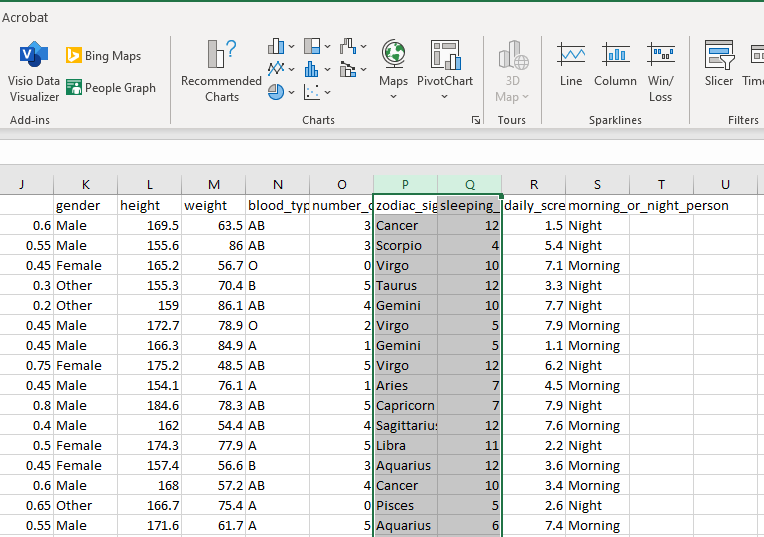
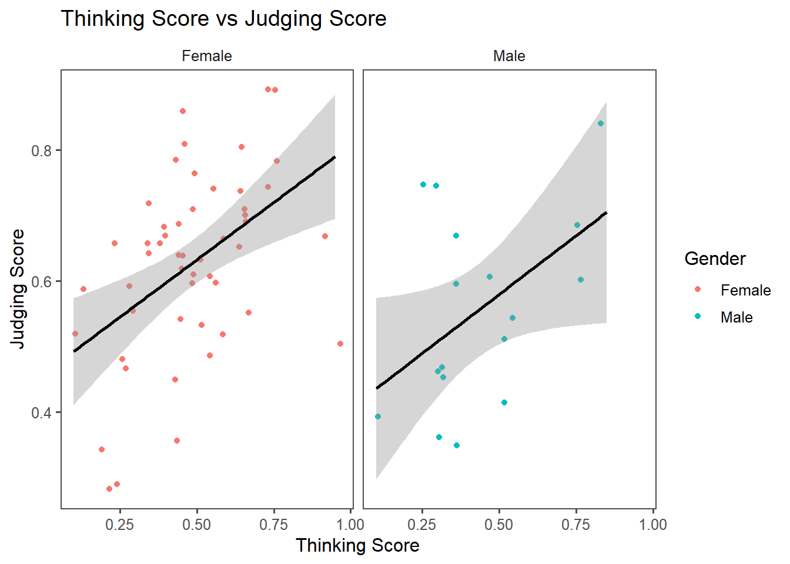

---

# **1. Grammar of Graphics**

---

Previously, when creating plots using tools like Microsoft Excel, you could simply click, drag, and adjust elements using a **Graphical User Interface (GUI)**. The process was intuitive and relied on visual interactions. However, in R, plotting involves using a **Command-Line Interface (CLI)**, where you instruct the computer to generate plots by writing commands.

<br>



<br>

This shift from GUI to CLI can seem challenging at first, but it opens up a world of **precision** and **customization**. To make this transition smoother, consider this question:

---

***How can we provide our text-based instructions to be clear enough to produce plots that are not only informative but also visually appealing, especially if those plots are complex?***

---

Let's start with an example. Could you provide an description in your own words to generate the following plot based on our MBTI dataset?

<br>


```
## `geom_smooth()` using formula = 'y ~ x'
```



<details> <summary>**Try to think about the instruction yourself first. Once you're done, click to see an example.**</summary>
1. Create a plot based on a dataframe `MBTI`.
2. For visual aesthetics, map Thinking Score (Column `T`) to the x-axis, Judging Score (Column `J`) to the y-axis, and use colors to represent Gender (Column `gender`).
3. Represent the data points with dots (one dot for each student), making sure their positions slightly are adjusted to avoid overlapping.
4. Add a trend line to show the overall relationship between Thinking Score and Judging Score.
5. Split the plot into smaller panels based on the categories in Gender (Column `gender`) to highlight group-specific patterns.
6. Include a title, axis labels, and a legend to make the plot clear and informative. Use a simple, clean theme to make the plot visually appealing and easy to understand.
</details>

---

The instruction you came up with may differ from the version above. **Do you think your version is comprehensive enough?** Are there any parts missing or unclear? 

To facilitate how we construct a plot, there is a concept called **Grammar of Graphics**, proposed by the statistician/computer scientist **Leland Wilkinson**. This framework breaks down visualizations into fundamental components, which can be thought of as layers that work together to build a complete plot. It provides a structured way to think about and describe visualizations systematically so we can code by command lines.

When Hadley Wickham developed `ggplot2`, the package we will use for visualization here, he adopted and extended this concept, making it widely used for creating data visualizations in R.

The layers in the Grammar of Graphics are shown below. You would build a plot **FROM THE BOTTOM TO THE TOP**.


<br>

**The layers are**:

**1. Data***

**2. Aesthetics (Aesthetic Mappings)***

**3. Geometries (Geometric Objects)***

**4. Facets**

**5. Statistics**

**6. Coordinates**

**7. Themes**

*At the minimum, we need to provide 1-3 to `ggplot2` to generate a plot.If you don't specify anything else, `ggplot2` will infer labels from existing info from the dataframe and use `theme_grey()` as the default theme

---

[Previous: Table of Contents](index.html) | [Next: 2. Constructing a Plot](constructing-a-plot.html)  

