---

# **2. Constructing a  Plot**

---

To access the relevant functions in `ggplot2`, a key visualization package of the `tidyverse`, and help pages needed for this chapter, load the `tidyverse` package, which contains `ggplot2` package, by executing the following code:


``` r
library(tidyverse)
```

This single line of code loads the core tidyverse packages, which are essential for most data analysis tasks. It also highlights any conflicts between `tidyverse` functions and those from base R or other loaded packages.

If you encounter the error message `“there is no package called ‘tidyverse’`,” it means the `tidyverse` is not installed on your system. To resolve this, install the package first and then run `library()` again.


``` r
install.packages("tidyverse") # Only run this line if you haven't not install tidyverse yet. You only need to install it once.
library(tidyverse)
```

A package only needs to be installed once, but you must reload it at the start of every new session.

When it's necessary to clarify which package a function or a dataset comes from, we use the format `package::function()`. For instance, `ggplot2::ggplot()` specifies that the `ggplot()` function is being used from the `ggplot2` package.

---

## **2.1 Data: Which Dataframe to Use?**

---

Let’s explore our first graph to answer a question:

<br>
**Do people with higher Thinking scores also have higher Judging scores, and does this trend hold across different genders?**

<br>
You might have come up with this question after noticing that your friends who love debating and solving math problems also seem to prefer planning their schedules ahead of time, while those who go with their gut feelings often leave things until the last minute. Maybe you’ve also seen that this pattern seems stronger among your female friends but less obvious among your male friends. Now, you’re curious to see if this trend holds true in a larger group 

<br>
Of course, I’m making this up, but I hope this example illustrates how personal observations can inspire interesting questions about behavior and traits.

<br>
You can test your answer with the MBTI dataframe. Start by importing the data.


``` r
MBTI <- read_csv("MBTI_survey_results_cleaned.csv")
```

```
## Rows: 68 Columns: 23
## ── Column specification ────────────────────────────────────────────────────────
## Delimiter: ","
## chr  (8): EI, NS, JP, MBTI, gender, blood_type, zodiac_sign, morning_or_nigh...
## dbl (14): student, E, F, I, J, N, P, S, T, height, weight, number_of_sibling...
## lgl  (1): FT
## 
## ℹ Use `spec()` to retrieve the full column specification for this data.
## ℹ Specify the column types or set `show_col_types = FALSE` to quiet this message.
```

**Reminder**: A dataframe is a rectangular table where columns represent **variables** (features) and rows represent **observations** (individual data entries).

Think of a dataframe as **column-focused**:

- Each **column** corresponds to **a specific variable or feature** in your dataset.
- For example, if you're interested in the blood types of people surveyed, you would look at the `blood_type` column. Each entry (row) in that column represents the blood type of a different person.

Now imagine filling out a questionnaire:

- Each question in the form represents a variable (column), like age, height, or favorite color.
- When you complete the questionnaire, all your answers go into a single row in the dataframe.
- The next person’s answers will go into the row below yours, filling out the same set of variables (columns).

This structure makes it easy to analyze or manipulate individual **variables (columns)** while keeping track of the corresponding **observations (rows)**.

How do we check the imported dataframe?

``` r
head(MBTI)
```

```
## # A tibble: 6 × 23
##   student     E     F     I     J     N     P     S     T EI    NS    FT   
##     <dbl> <dbl> <dbl> <dbl> <dbl> <dbl> <dbl> <dbl> <dbl> <chr> <chr> <lgl>
## 1       1   0.8  0.5    0.2  0.6   0.5   0.4   0.5   0.5  E     N     FALSE
## 2       2   0.4  0.55   0.6  0.65  0.35  0.35  0.65  0.45 I     S     FALSE
## 3       3   0    0.25   1    0.6   0.5   0.4   0.5   0.75 I     S     TRUE 
## 4       4   0.3  0.55   0.7  0.6   0.4   0.4   0.6   0.45 I     S     FALSE
## 5       5   0.4  0.8    0.6  0.35  0.5   0.65  0.5   0.2  I     N     FALSE
## 6       6   0.4  0.45   0.6  0.55  0.5   0.45  0.5   0.55 I     N     TRUE 
## # ℹ 11 more variables: JP <chr>, MBTI <chr>, gender <chr>, height <dbl>,
## #   weight <dbl>, blood_type <chr>, number_of_siblings <dbl>,
## #   zodiac_sign <chr>, sleeping_hours <dbl>, daily_screen_time <dbl>,
## #   morning_or_night_person <chr>
```

Among the variables in the dataset are:

- **`E`, `I`, `N`, `S`, `T`, `F`, `J`, `P`**: Scores for each MBTI dimension (e.g. Extroversion (E), Thinking (T)).
- **`MBTI`**: The MBTI type (e.g. ESTJ, INFJ).
- **`gender`**: Gender of the individual (e.g. Male, Female, Other).
- **`height`** and **`weight`**: Physical characteristics.
- **`blood_type`**: Blood type of the individual.
- **`number_of_siblings`**: Number of siblings.
- **`zodiac_sign`**: Zodiac sign of the individual.
- **`sleeping_hours`**: Average sleeping hours per day.
- **`daily_screen_time`**: Average daily screen time in hours.
- **`morning_or_night_person`**: Whether the person prefers mornings or nights.

---

**Do you notice something wrong with the imported dataframe?** *Hint: quickly check the imported values in each column*

<details> <summary>**Click to see the answer.** </summary>

Column FT, which should contain the decision whether it's `F` (Feeling) or `T` (Thinking), was interpreted as logical (`TRUE`/`FALSE`). Note the data type (`lgl`). To fix this, we need to specify column `FT` as `character`:


``` r
MBTI <- read_csv("MBTI_survey_results_cleaned.csv", col_types = cols(FT = col_character()))
head(MBTI)
```

```
## # A tibble: 6 × 23
##   student     E     F     I     J     N     P     S     T EI    NS    FT   
##     <dbl> <dbl> <dbl> <dbl> <dbl> <dbl> <dbl> <dbl> <dbl> <chr> <chr> <chr>
## 1       1   0.8  0.5    0.2  0.6   0.5   0.4   0.5   0.5  E     N     F    
## 2       2   0.4  0.55   0.6  0.65  0.35  0.35  0.65  0.45 I     S     F    
## 3       3   0    0.25   1    0.6   0.5   0.4   0.5   0.75 I     S     T    
## 4       4   0.3  0.55   0.7  0.6   0.4   0.4   0.6   0.45 I     S     F    
## 5       5   0.4  0.8    0.6  0.35  0.5   0.65  0.5   0.2  I     N     F    
## 6       6   0.4  0.45   0.6  0.55  0.5   0.45  0.5   0.55 I     N     T    
## # ℹ 11 more variables: JP <chr>, MBTI <chr>, gender <chr>, height <dbl>,
## #   weight <dbl>, blood_type <chr>, number_of_siblings <dbl>,
## #   zodiac_sign <chr>, sleeping_hours <dbl>, daily_screen_time <dbl>,
## #   morning_or_night_person <chr>
```

</details>

---

Now, let's start with the first layer of the Grammar of Graphics: `data`. We now know that our plot will be based on this dataframe `MBTI`. 

Start by constructing a plot by the function `ggplot()`. Note the function name `ggplot()` vs the package name `ggplot2`.

What do you expect to see from the following code?


``` r
ggplot(data = MBTI)
```

<details> <summary>**Click to see the output.** </summary>


``` r
ggplot(data = MBTI)
```


This is expected. We just instruct the `ggplot()` function to know which dataframe to use. We have not even provided which variables to plot yet. Anyway, you can think about this as setting up a blank canvas for the plot.

</details>

---

## **2.2 Aesthetics: Which and How Variables to be Mapped to the Plot?**

Now we've provided ggplot() with the dataframe `MBTI`. Next, we need to think about which variables (aka. columns) we would use to generate the plot.

The three variables to be used are:

1. **Thinking Score** (Column `T`)       : to be mapped to **X-axis**
2. **Judging Score** (Column `J`)        : to be mapped to **Y-axis**
3. **Gender** (Column `gender`)   : to be mapped as **different colors**

We can use the function `aes()` to capture this information.

The format will be: `aes(x = T, y = J, color = gender)`

Let's try running the code below:


``` r
aes(x = T, y = J, color = gender)
```
<details><summary> Click to see the output </summary>


``` r
aes(x = T, y = J, color = gender)
```

```
## Aesthetic mapping: 
## * `x`      -> `T`
## * `y`      -> `J`
## * `colour` -> `gender`
```

You can see that the output provides a description of the aesthetic mappings we assigned, as `aes()` is a quoting function that captures and reports these mappings without directly executing them.

</details>

Now, let's try to instruct ggplot that the aesthetics will be based on the `MBTI` dataframe.


``` r
ggplot(data = MBTI, aes(x = T, y = J, color = gender))
```

What do you expect to see?

<details><summary> Click to see the output </summary>


``` r
ggplot(data = MBTI, aes(x = T, y = J, color = gender))
```

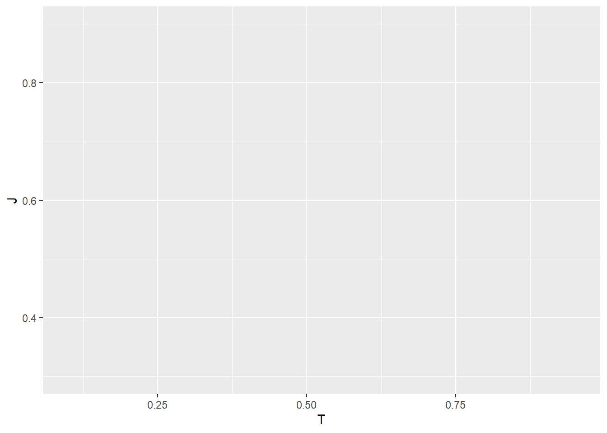

The output is no longer a blank canvas as it shows a blank plot with axes labeled "T" (Thinking Score) and "J" (Judging Score). Still, nothing is there yet, as we have not assign the type/shape of the plot to be shown yet.

</details>

---

## **2.3 Geometrics: Which Type/Shape of Plots to be Used?**

Now, we need to decide what type of plot would be appropriate for our variables.

Since the variables mapped to the x-axis and y-axis are both continuous, **a scatter plot** would be the most suitable choice. Scatter plots effectively show the relationship between two continuous variables by representing each observation as a point on the plot.

In the Grammar of Graphics, these visual representations are referred to as **geometric objects** or **geoms**. Geometric objects determine the shape or type of visualization used to display the data, such as points, lines, or bars. For our example, the geometric object we use is a scatter plot, represented by dots.

**Examples of Commonly Used Functions to Create Geometric Objects (Geoms)**:

1. `geom_point()` 
   - Used for scatter plots to represent individual data points.  
2. `geom_line()`  
   - Creates a line plot to show trends or changes over a continuous variable.  
3. `geom_bar()` 
   - Creates bar plots for categorical data.  
4. `geom_histogram()`  
   - Displays the distribution of a single continuous variable by dividing it into bins.  
5. `geom_boxplot()`
   - Displays the distribution and variability of a continuous variable across categories.  

**Each `geom_` function in `ggplot`2 takes a mapping parameter with the arguments in the form of aesthetics.** 

Here, we will create a scatter plot using `geom_point()`


``` r
ggplot(data = MBTI) + 
  geom_point(mapping = aes(x = T, y = J, color = gender))
```

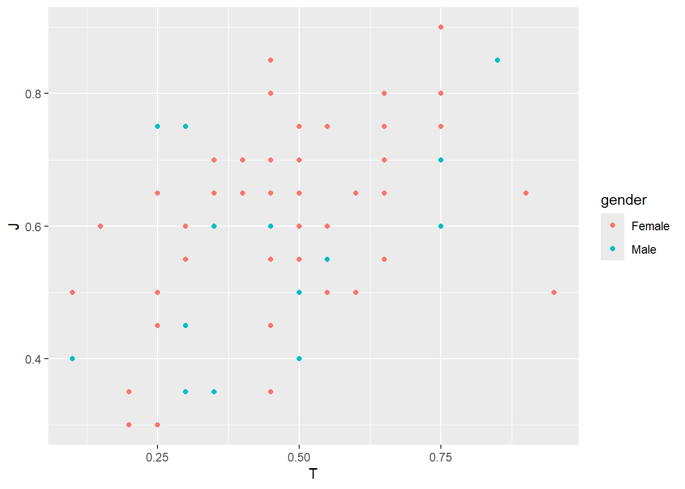

**Look at the code again and see if you understand the meaning in its structure.**

Do you notice how we can layer the Grammar of Graphics here? **We can conveniently use `+` to add the next layer to our plot**. Typically, we place the `+` at the end of a line, followed by the next layer on a new line.

But what happens if the command is left unfinished? For example, you accidentally run the code below:


``` r
ggplot(data = MBTI) + 
```

In the console, R will display:

```
+
```

If you accidentally left the command unfinished and want to stop, press `Esc` (on Windows/Mac) 

---

**Do you notice something missing from the above scatter plot?** *Hint: check how many observations we expecting*

---

We expect 68 observations, but fewer than 68 points are displayed. This happens because **some data points overlap**, meaning multiple points are plotted at the same location, making them appear as one. This issue, known as **overplotting**, can obscure the true distribution of the data.

To resolve this, we can use `geom_jitter()`, which slightly adjusts the position of each point to prevent overlap. By adding a small amount of **random noise** (or **"jitter"**) to the x and/or y coordinates, `geom_jitter()` ensures all data points are visible while maintaining their general positioning. This makes it easier to interpret the scatter plot without losing information.


``` r
ggplot(data = MBTI) + 
  geom_jitter(mapping = aes(x = T, y = J, color = gender))
```

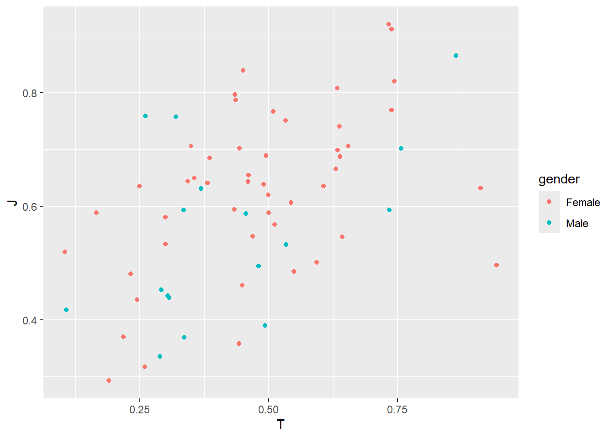

&nbsp;&nbsp;&nbsp;&nbsp;&nbsp;&nbsp;&nbsp;&nbsp;&nbsp;&nbsp;&nbsp;&nbsp;&nbsp;&nbsp;&nbsp;&nbsp;&nbsp;&nbsp;&nbsp;&nbsp;**VERY BEAUTIFUL TREND OBSERVED IN OUR CLASS!**

---

**SUMMARY**

As mentioned previously, the minimum requirement for us to provide as input to `ggplot2` are 

**1.Data** 

**2.Asthetics**

**3.Geometrics**

These components can be constructed as follows:


``` r
ggplot(data = <DATA>) + 
  <GEOM_FUNCTION>(mapping = aes(<MAPPINGS>))
```

Often, you will see people simplifying the code by omitting explicit parameter names when they are implied:


``` r
ggplot(<DATA>) + 
  <GEOM_FUNCTION>(aes(<MAPPINGS>))
```

In other words, the following code achieves the same result:

``` r
ggplot(MBTI) + 
  geom_jitter(aes(x = T, y = J, color = gender))
```

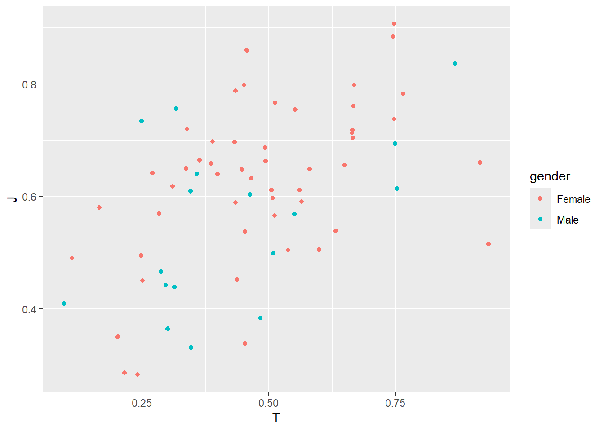

Now you can see why many people find `ggplot2`'s grammar confusing at first (so many parentheses!). 

I recommend **keeping explicit parameter names until you become familiar with the structure**. 

In fact, some prefer never dropping them at all to ensure the code is more readable and easier to understand. Clear, explicit code makes it simpler to debug and interpret later.

---

**Exercise**

1. Create a scatterplot of `E` (Extroversion) vs `daily_screen_time`, colored by gender.
2. Create a scatterplot of `E` (Extroversion) vs `I` (Introversion). Why does the relationship look like that?
3. What happens if you create a scatterplot of `zodiac_sign` vs `blood_type`? Why might this plot not be useful?

---

## **2.4 Facets: Split the Plot into Subplots**

Sometimes, we want to compare patterns across different categories within our data. Instead of plotting everything on a single graph, we can **split the visualization into multiple smaller panels**, each showing a subset of the data. This technique is called **faceting**, and it helps reveal patterns that might be hidden in an overcrowded plot.

For example, in our `MBTI` dataset, we may want to examine the relationship between Thinking Score and Judging Score across different genders. By faceting the plot by `gender`, we can see how this relationship varies within each group, rather than having all the data points mixed together in a single plot.

Faceting is particularly useful when dealing with categorical variables, as it allows us to visualize trends separately while maintaining the same axis scales for easy comparison.


``` r
ggplot(MBTI) + 
  geom_jitter(aes(x = T, y = J, color = gender)) + 
  facet_wrap(~ gender)
```

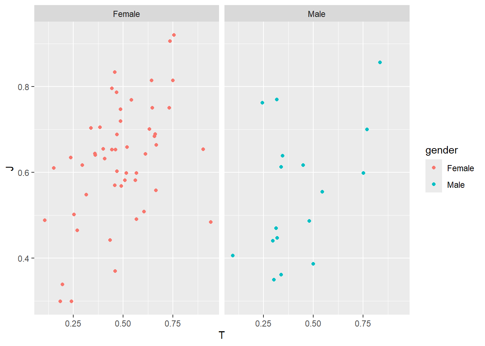

`facet_wrap()` is a function in `ggplot2` that allows us to split a plot into multiple subplots, each displaying a subset of the data based on **ONE** categorical variable. This helps us compare patterns across different groups without cluttering a single plot.

The `~` symbol inside `facet_wrap(~ gender)` defines a formula in R, indicating that we want to create facets based on the gender variable. Each unique value in gender will generate a separate panel, making it easier to observe trends within each group while maintaining consistent axis scales across all facets.

---

**What if you'd like to split the plot based on two categorical variables?**

---


``` r
ggplot(MBTI) + 
  geom_jitter(aes(x = T, y = J, color = gender)) + 
  facet_grid(gender ~ morning_or_night_person)
```

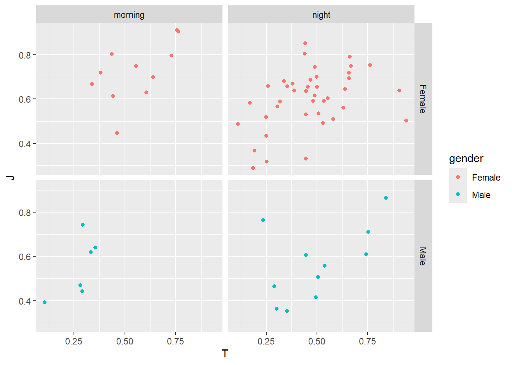

`facet_grid()` creates a grid of subplots based on two categorical variables.

In this example, `facet_grid(gender ~ morning_or_night_person)` means:

- Rows represent different levels of `gender`
- Columns represent different levels of `morning_or_night_person`

This ensures that every combination of `gender` and `morning_or_night_person` gets its own panel, making it easy to compare trends across multiple categorical groups in a structured layout.

With this visualization, we could see that all male, morning-person students have **low Thinking scores**, meaning they tend to score higher on the **Feeling (F) scale** instead. This implies that in this group, **morning-oriented males may be more emotionally driven in their decision-making.**

**This is really interesting! We can look more into this group to see if some other variables may explain this more.**

---

**Exercise**

1. What happens if you facet on a continuous variable?
2. What plots does the following code make? What does . do?


``` r
ggplot(data = MBTI) + 
  geom_jitter(mapping = aes(x = T, y = J)) + 
  facet_grid(gender ~ .)

ggplot(data = MBTI) + 
  geom_jitter(mapping = aes(x = E, y = T)) + 
  facet_grid(. ~ morning_or_night_person)
```

<details><summary> Click to see the answer </summary>

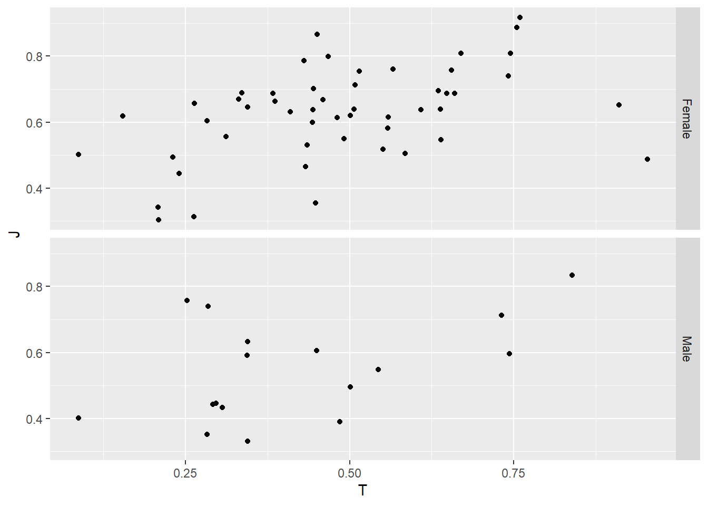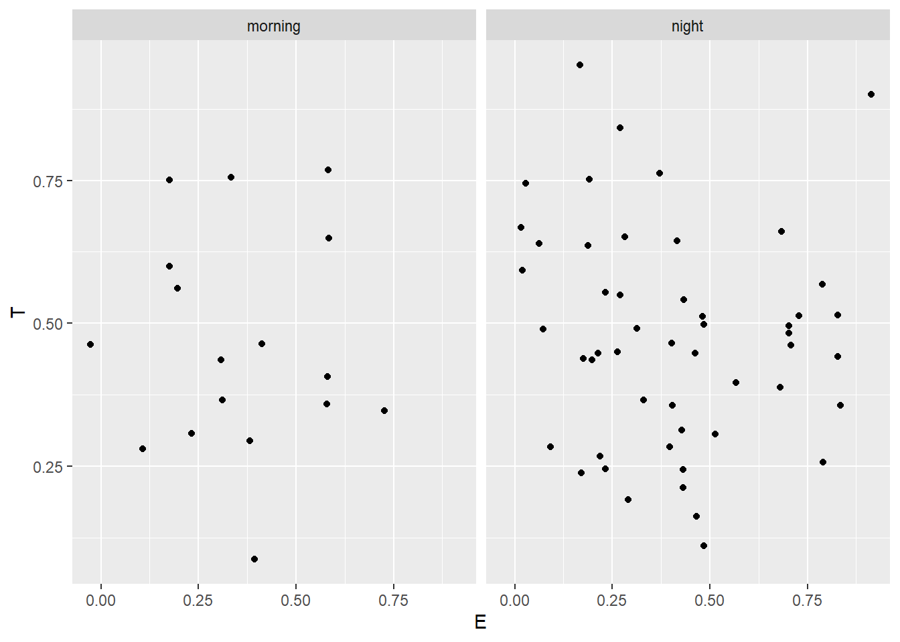

</details>

3. Read `?facet_wrap`. What does `nrow` do? What does `ncol` do? What other options control the layout of the individual panels? Why doesn’t `facet_grid()` have `nrow` and `ncol` arguments?

<details><summary> Click to see the answer </summary>
In `facet_wrap()`, the `nrow` argument controls the number of rows in the faceted plot, while `ncol` controls the number of columns. These options allow for flexibility in arranging the panels, especially when there are many categories. Other options that influence the layout include `scales`, which determines whether axes are shared across facets, and `strip.position`, which controls the placement of facet labels.

`facet_grid()`, on the other hand, does not have `nrow` and `ncol` arguments because it follows a strict grid structure based on two categorical variables—one for rows and one for columns. Since the number of rows and columns is determined by the unique levels of the faceting variables, manual control over layout dimensions is unnecessary.
</details>

---

## **2.5 Statistics: Adding Summarized Information to Plots**

So far, we have been plotting raw data points, but sometimes we need to add summarized information to help interpret trends and patterns. In `ggplot2`, statistical transformations allow us to compute and visualize summaries like **trend lines**, **averages**, **counts**, or **density distributions** directly on the plot.

For example, in our scatter plot of Thinking Score vs. Judging Score, we might want to add a trend line to see the overall relationship between the two variables. This is where statistical layers, such as `geom_smooth()`, come into play.


``` r
ggplot(MBTI) + 
  geom_jitter(aes(x = T, y = J, color = gender)) +
  geom_smooth(method = "lm", aes(x = T, y = J))
```

```
## `geom_smooth()` using formula = 'y ~ x'
```

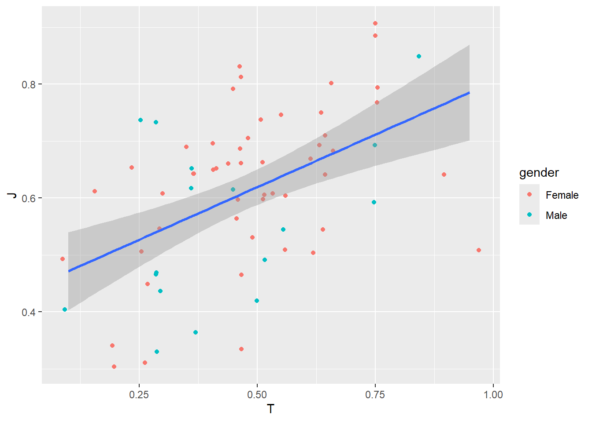

The `geom_smooth()` function adds a trend line to the plot, summarizing the relationship between the two variables. In this case, `method = "lm"` specifies a linear model, meaning the function fits a straight line to the data. This helps to highlight overall patterns that may not be immediately clear from the raw data points. The aesthetic mapping inside `aes(x = T, y = J)` ensures that the trend line is computed using the same variables as the jittered data points.

---

Different types of plots also use built-in statistical transformations. For example:

- **Bar plots** (`geom_bar()`) automatically count observations for each category.
- **Histograms** (`geom_histogram()`) compute frequency bins.
- **Density plots** (`geom_density()`) estimate the probability distribution of a continuous variable.

By incorporating these statistical elements, we can enhance our visualizations to provide deeper insights into the data.

---

## **2.6 Coordinates: Controlling the Plot’s Scale and Aspect Ratio**

The **coordinate system** determines how data is mapped onto the plotting area, influencing the **scaling, aspect ratio, and orientation** of the visualization. By default, `ggplot2` uses the Cartesian coordinate system (`coord_cartesian()`), but other options allow for transformations that can change how data is represented.

For example, zooming in on a specific range of values without removing data points can be done using `coord_cartesian(xlim = ..., ylim = ...)`. Some plots may also benefit from alternative coordinate systems, such as:

- `coord_flip()`: Swaps the x- and y-axes
- `coord_fixed()`: Ensures equal aspect ratios, preserving relative distances.
- `coord_polar()`: Converts Cartesian coordinates into polar form, useful for radar charts or pie charts.

Adjusting the coordinate system allows greater flexibility in how data is visually represented, making it easier to emphasize key insights.

---

**Examples**

---


``` r
ggplot(MBTI) + 
  geom_jitter(aes(x = T, y = J, color = gender)) +
  geom_smooth(method = "lm", aes(x = T, y = J)) +
  coord_flip()
```

```
## `geom_smooth()` using formula = 'y ~ x'
```

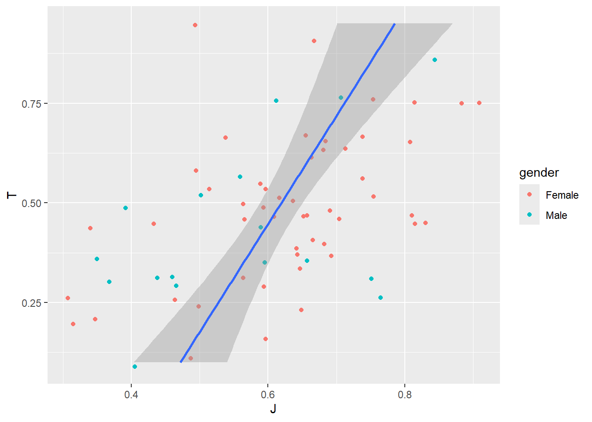

---


``` r
ggplot(MBTI) + 
  geom_jitter(aes(x = T, y = J, color = gender)) +
  geom_smooth(method = "lm", aes(x = T, y = J)) +
  coord_fixed(ratio = 1.5)
```

```
## `geom_smooth()` using formula = 'y ~ x'
```

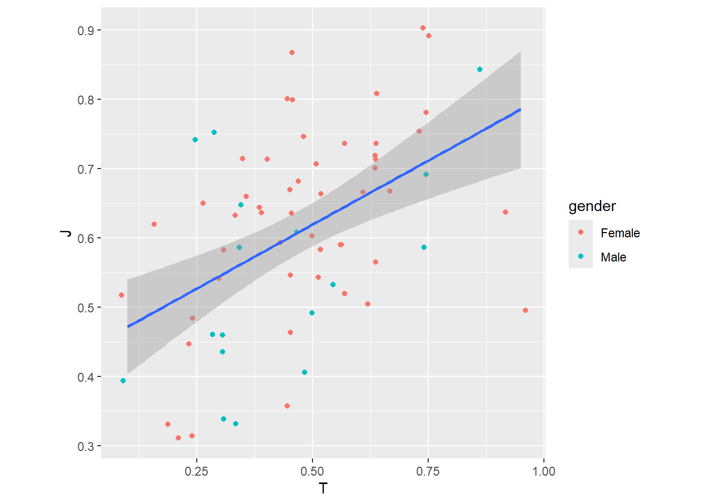

---

**Using `coord_polar()` to create a pie chart**


``` r
ggplot(MBTI) + 
  geom_bar(aes(x = "", fill = gender), width = 1) #Creates a bar chart where the x-axis is empty (""), meaning all bars stack into one column, colored by gender
```

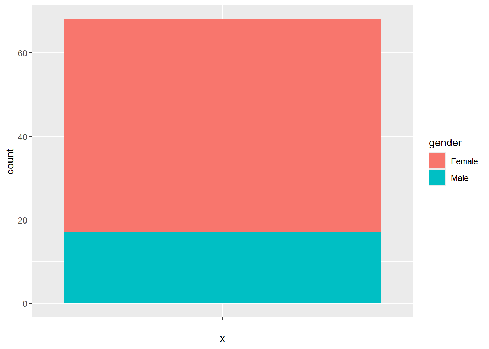


``` r
ggplot(MBTI) + 
  geom_bar(aes(x = "", fill = gender), width = 1) + 
  coord_polar(theta = "y")
```

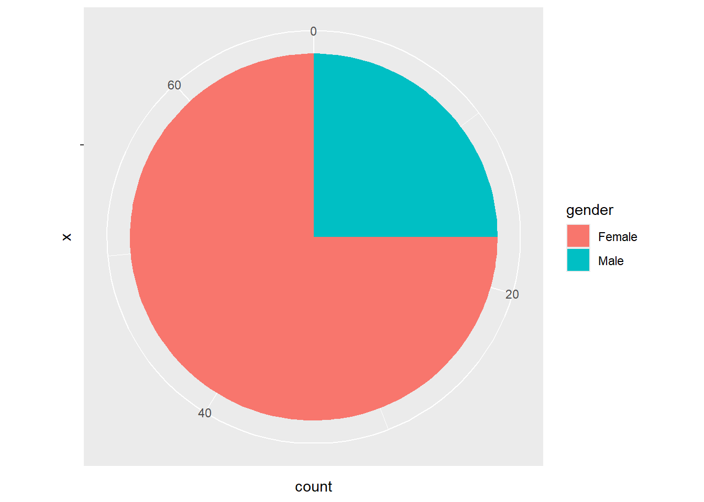

This is a crude method. You will learn about data manipulation later so the visualization would be more informative (e.g. illustrating proportion instead of counts)

---

## **2.7 Theme: Controlling the Appearance of a Plot**

While we have focused on data representation, **the overall look and feel of a plot** also play a crucial role in making visualizations clear, professional, and publication-ready. `ggplot2` provides themes that allow us to control elements like **backgrounds**, **grid lines**, **font sizes**, **axis styles**, and **legends**.

By default, `ggplot2` applies the theme_grey() theme, but we can customize the appearance using built-in themes such as:

- `theme_bw()` – A clean black-and-white theme with a white background.
- `theme_minimal()` – A simple, modern look with fewer grid lines.
- `theme_classic()` – A traditional theme without grid lines.
- `theme_void()` – A completely empty background, great for pie charts.

*Personally, I prefer `theme_classic()` based on its clean appearance.*

Beyond the built-in themes, other packages offer even more customization options:

- `ggthemes` – Provides additional themes like Economist, Wall Street Journal, and Tufte-style minimalist themes.
- `bbplot` – Designed for BBC-style graphics with a professional and polished look.
- `hrbrthemes` – A collection of modern, publication-quality themes.

Additionally, the `theme()` function allows for fine-tuned adjustments, such as font sizes, colors, grid visibility, spacing, and legend positioning. With these tools, we can ensure our plots are not only informative but also visually appealing and suitable for presentations, reports, or publications.

---

**Change the default theme to `theme_classic()`**


``` r
ggplot(MBTI) + 
  geom_jitter(aes(x = T, y = J, color = gender)) +
  geom_smooth(method = "lm", aes(x = T, y = J)) +
  theme_classic()
```

```
## `geom_smooth()` using formula = 'y ~ x'
```

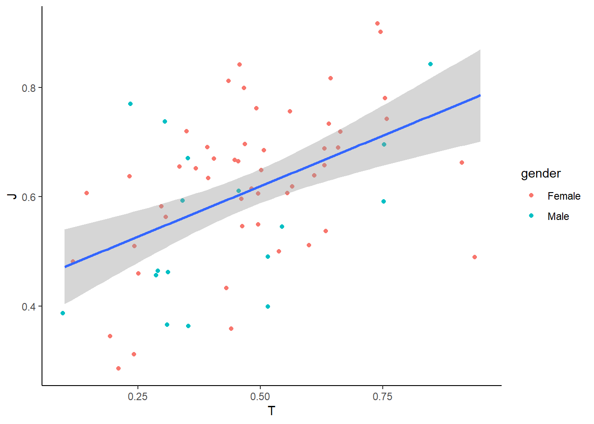

---

**Add customization**


``` r
ggplot(MBTI) + 
  geom_jitter(aes(x = T, y = J, color = gender)) +
  geom_smooth(method = "lm", aes(x = T, y = J)) +
  theme_classic() + 
  theme(
    plot.title = element_text(size = 16, face = "bold", hjust = 0.5),  # Centered bold title
    axis.title = element_text(size = 14),  # Larger axis labels
    axis.text = element_text(size = 12),  # Adjust axis text size
  ) +
  labs(
    title = "Relationship Between Thinking and Judging Scores",
    x = "Thinking Score",
    y = "Judging Score"
  )
```

```
## `geom_smooth()` using formula = 'y ~ x'
```

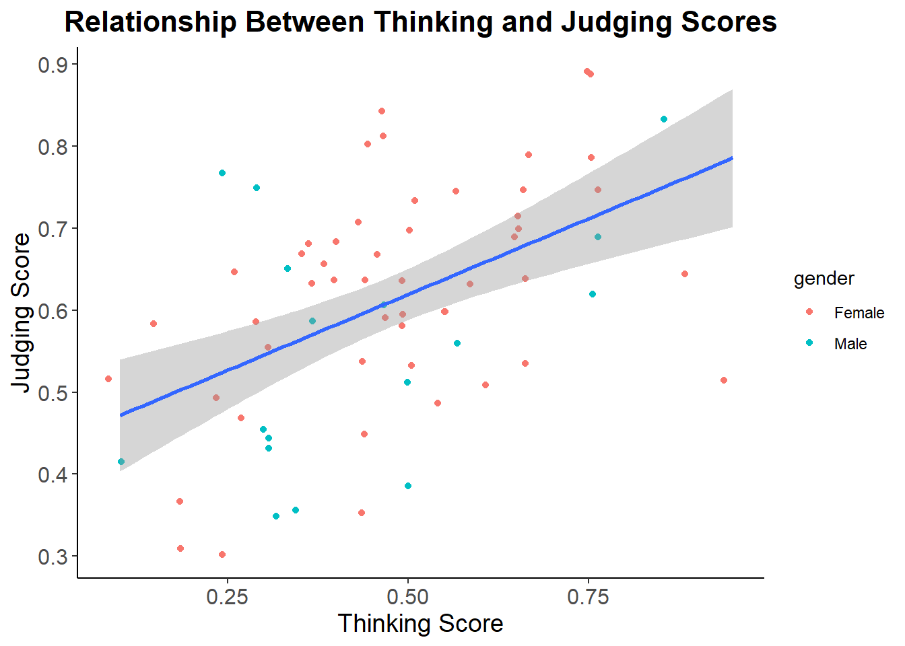

**Another example with faceting on gender with a theme from another package, with more customization**


``` r
library(ggthemes) # Use a theme from another package called "ggthemes"

ggplot(data = MBTI) +
  geom_jitter(mapping = aes(x = T, y = J, color = gender)) +
  geom_smooth(method = "lm", aes(x = T, y = J), color = 'black') +
  facet_wrap(~ gender) +
  labs(
    title = "Thinking Score vs Judging Score in Different Genders",
    x = "Thinking Score",
    y = "Judging Score"
  ) +
  theme_economist() + # theme_economist() is from the package "ggthemes"
  theme(
    legend.position = "none",  # Removes the legend
    plot.title = element_text(margin = margin(b = 15))  # Adds space below the title
  )
```

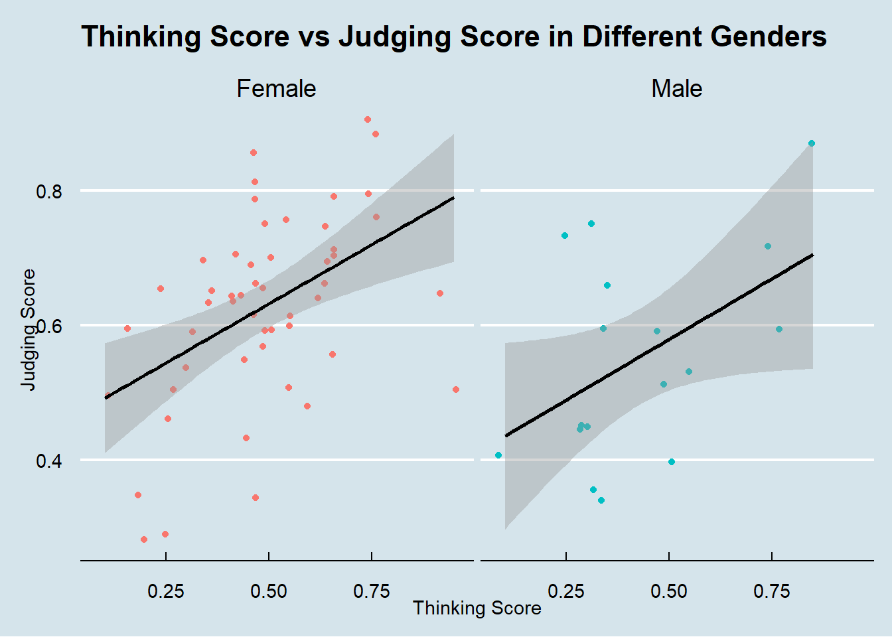


[Previous: 1. Grammar of Graphics](grammar-of-graphics.html) | [Next: 3. Visualizing a Continuous Variable](visualizing-a-continuous-variable.html)  
