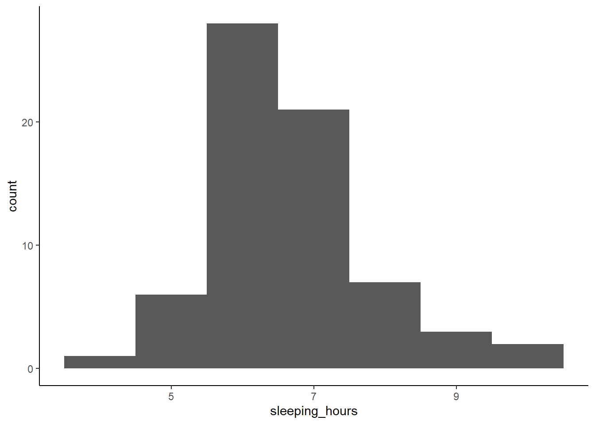
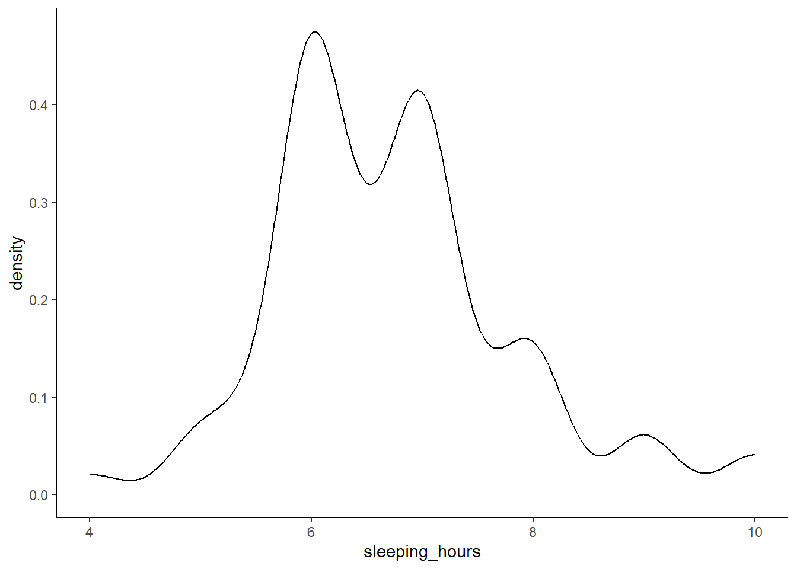
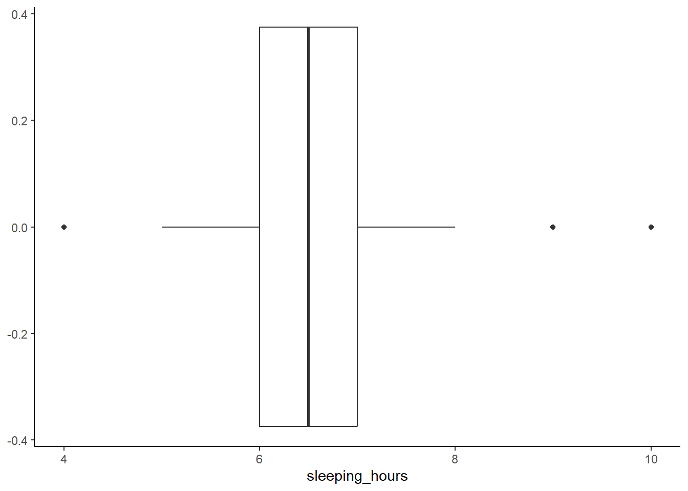
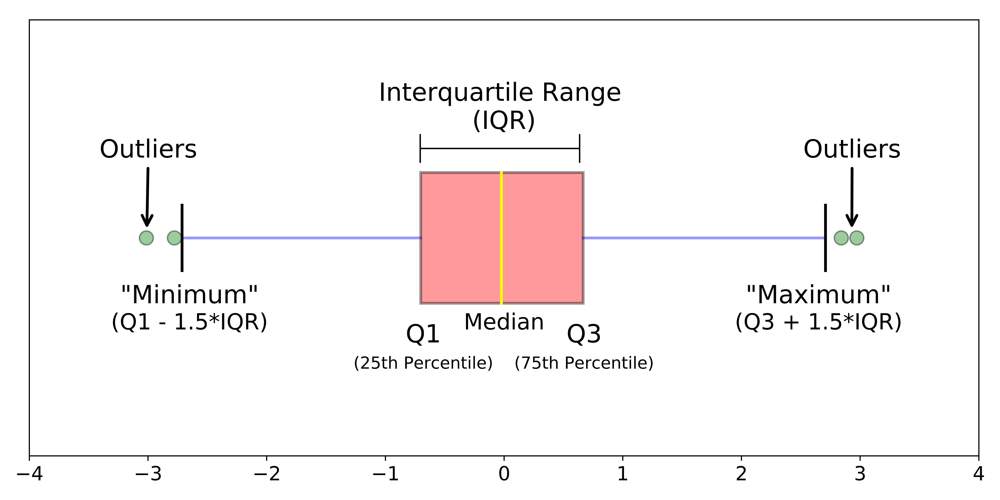
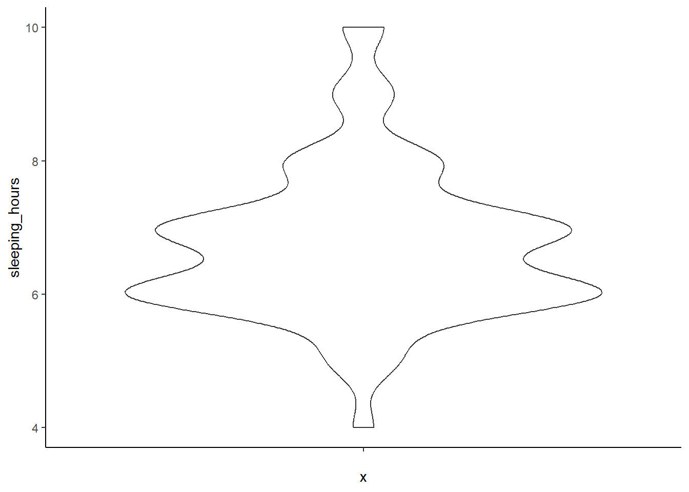
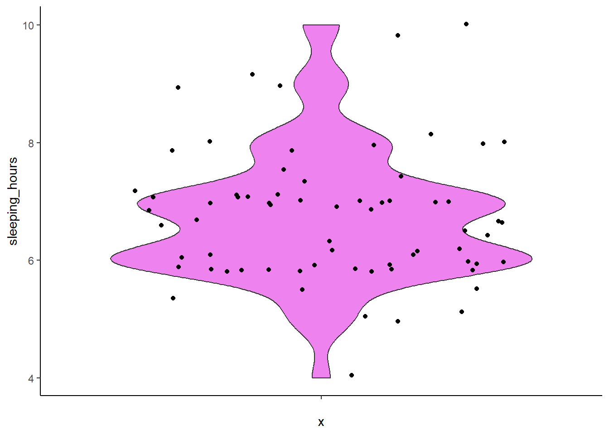

---

# **3. Visualizing a Continuous Variable**

---

**What kind of visualization should we use for a continuous variable?**

Let’s say we want to explore `sleeping_hours` to better understand the sleep patterns in our group. How can we visualize this data in a way that provides more insight than just reporting an average?

---

When working with continuous data, we often want to understand **how values are distributed across all observations**, as well as where **a representative value**, like an average, lies within the distribution. A single summary statistic, such as the mean, can give us a general sense of central tendency, but it doesn’t reveal **variability, skewness, or the presence of outliers**.


When we analyze how many hours students sleep per night, **the average sleep duration in our dataset is 6.74 hours**, but does that mean most students sleep around **6-7 hours**? Not necessarily! Some students may sleep only **4 hours**, while others may get **9+ hours** of rest. Simply reporting an average doesn’t tell us how sleep hours are distributed or whether there are any extreme values.

By visualizing the data, we can see the full distribution rather than relying on a single number. This helps us answer key questions like:

- Do most students sleep close to the average, or is there a wide range?
- Are there outliers who sleep significantly more or less than others?
- Is the distribution symmetrical, or do more students tend to sleep fewer/more hours?

There are several ways to visualize a continuous variable, each highlighting different aspects of the data:

- **Histograms** – Show how frequently different sleep durations occur.
- **Density Plots** – Provide a smooth curve to represent the distribution shape.
- **Box Plots** – Summarize key statistics and highlight potential outliers.
- **Violin Plots** – Combine box plots and density plots for richer visualization.

Each method provides unique insights into how sleep patterns vary across students. Next, we’ll explore these techniques and discuss when to use them effectively.

---

## **3.1 Histogram: Showing Frequency of Sleep Durations**

A **histogram** groups sleep hours into **bins**, turning the continuous variable into the discrete one, making it easy to see how frequently different sleep durations occur. This helps us identify the most common sleep patterns and whether the data is normally distributed or skewed.


``` r
ggplot(MBTI) + 
  geom_histogram(aes(x = sleeping_hours), binwidth = 1) + 
  theme_classic()
```



---

**Why use a histogram?**

- Shows how sleep hours are distributed across students.
- Helps identify clusters (e.g., do most students sleep 6-7 hours?).
- Reveals **skewness** (e.g., are there more students sleeping less or more than average?).

---

## **3.2 Density Plot: A Smooth Curve for Distribution**

A **density plot** is similar to a histogram but uses a smooth curve instead of bars. It provides a clearer view of the **overall shape** of the data without being affected by bin sizes.


``` r
ggplot(MBTI) + 
  geom_density(aes(x = sleeping_hours)) + 
  theme_classic()
```



---

**Why use a density plot?**

- Provides a **smoother representation** of the distribution.
- Useful for detecting multiple peaks (e.g., two distinct groups of sleepers).
- Helps visualize how common or rare different sleep durations are.

---

## **3.3 Box Plot: Identifying Outliers and Variability**

A **box plot** summarizes the distribution using quartiles, showing the **median**, **spread**, and **potential outliers**. This is useful for identifying students who sleep significantly less or more than the rest.


``` r
ggplot(MBTI) + 
  geom_boxplot(aes(x = sleeping_hours)) + 
  theme_classic()
```



How do you interpret the box plot here?

<details> <summary>**Click to see the answer.** </summary>



</details>

Why use a box plot?

- Highlights the **median** sleep duration.
- Shows the **interquartile range (IQR)**, which is the middle 50% of values, helping us understand variability.
- Easily identifies **outliers** (e.g., students who sleep extremely little or a lot like one sleeping 4 hours a day and two sleeping 9 and 10 hours a day).

---

## **3.4 Violin Plot: Combining Box Plot and Density Plot**

A violin plot merges the benefits of a box plot and a density plot, showing both summary statistics and the full distribution of sleep durations. Note that if you're only looking at one variable, it may be a better idea to do a separate approach (a histogram/density plot + a box plot rather than a single violin one).


``` r
ggplot(MBTI) + 
  geom_violin(aes(x = '', y = sleeping_hours)) + 
  theme_classic()
```



**Add color and show individual data points**


``` r
ggplot(MBTI) + 
  geom_violin(aes(x = '', y = sleeping_hours), fill = 'violet') +
  geom_jitter(aes(x = '', y = sleeping_hours)) +
  theme_classic()
```



---

**Why use a violin plot?**

- Shows the **spread** and **density** of sleep durations.
- Combines summary statistics with a visual shape of the data.
- Useful when **comparing multiple groups** (e.g., sleep patterns by gender or MBTI type).
- Most useful with **a large dataset**.

---

[Previous: 2. Constructing a Plot](constructing-a-plot.html)   | [Next: 4. Visualizing a Discrete (Categorical) Variable](visualizing-a-discrete-variable.html)  


