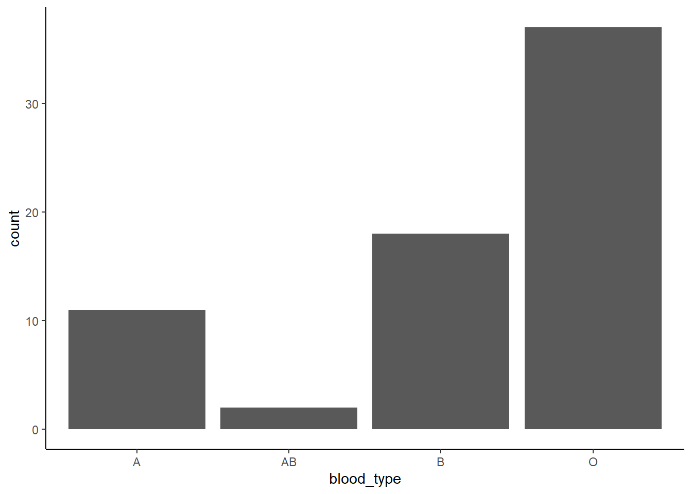
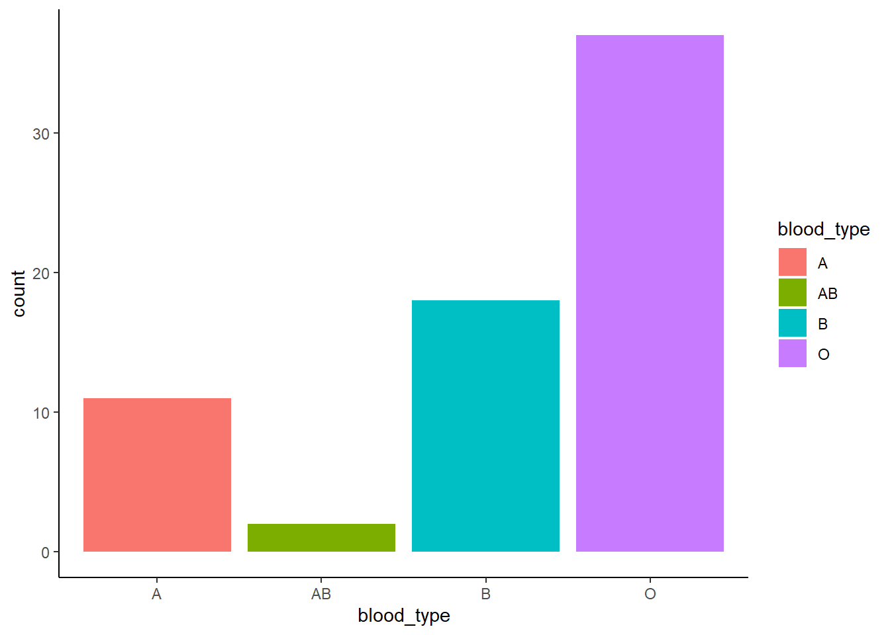
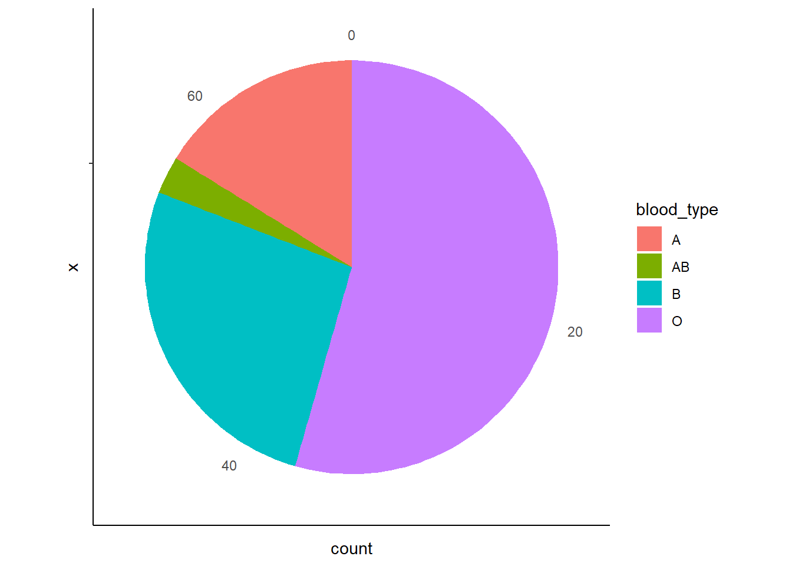

---

# **4. Visualizing a Discrete (Categorical) Variable**

---

**What kind of visualization should we use for a discrete (categorical) variable?**

Let’s say we want to explore blood types in our group. How many students have blood type A? How are they compared to those with other blood types? 

---

When working with categorical data, we often want to understand **how frequently different categories** occur. A simple table of counts can provide raw numbers, but visualizing the data makes it much easier to **compare groups**, **spot trends**, and **identify dominant categories**.

For example, in our `MBTI` dataset, we have several categorical variables, such as:

- Blood type (`blood_type`) – `A`, `B`, `AB`, `O`
- Gender (`gender`) – `Female`, `Male`
- MBTI personality type (`MBTI`) – `INTJ`, `ENFP`, `ISTP`, etc.

To explore categorical data effectively, we can use different types of visualizations:

- `Bar Charts` – The most common way to show category counts.
- `Pie Charts` – Show proportions as parts of a whole.

---

## **4.1 Bar Chart: Most Common Category/Categories**

A bar chart is the most straightforward way to visualize the frequency of each category.


``` r
ggplot(MBTI) + 
  geom_bar(aes(x = blood_type)) + 
  theme_classic()
```



**Filled colors based on blood types**


``` r
ggplot(MBTI) + 
  geom_bar(aes(x = blood_type, fill = blood_type)) +
  theme_classic()
```



Why are we using `fill` instead of `color` here?

<details><summary> Click to see the answer </summary>
In `ggplot2`, `color` and `fill` control different aspects of aesthetics. The `color` aesthetic is used for **points, lines, and the outlines of shapes**, applying to `geoms` like `geom_point()`, `geom_line()`, and `geom_boxplot()` (affecting the box outline). In contrast, `fill` is used for shapes with an **interior area**, such as bars, violins, and density plots (`geom_bar()`, `geom_violin()`, `geom_density()`), where it determines the **inside color**. 
</details>

---

**Why use a bar chart?**

- Clearly shows **which category is most/least common**.
- Easy to compare absolute counts **across categories**.

---

## **4.2 Pie Chart: Proportion of Blood Types**

If we want to see categories as proportions of the total group, a pie chart works ok if the data is not too complex.


``` r
ggplot(MBTI) + 
  geom_bar(aes(x = "", fill = blood_type), width = 1) + 
  coord_polar(theta = "y") +
  theme_classic()
```



---

**Why use a pie chart?**

- Helps visualize **proportions** 
- Useful when total size matters (e.g. "What percentage of students have blood type A?").

---

**Caution When Using Pie Charts**

While pie charts can be useful for showing proportions, they are not always the best choice. Here’s why:

**Pie charts can be hard to interpret when there are many categories.**

If there are too many slices, it becomes difficult to compare proportions accurately. Small differences between slices are harder to judge than in a bar chart.

**Bar charts are usually a better alternative in many cases.**

A bar chart allows for precise comparisons by looking at bar heights, whereas our eyes are better at comparing lengths (bars) than angles (pie slices).

**When should you use a pie chart?**

- When there are few categories (e.g. blood type with only 4 groups: A, B, AB, O).
- When you want to highlight one dominant category (e.g. "Most students have blood type O").
- When percentages are labeled clearly so that proportions are obvious.

If your data has many categories or small differences matter, **a bar chart is usually the better choice** for clarity and accuracy.

---

[Previous: 3. Visualizing a Continuous Variable](visualizing-a-continuous-variable.html)  | [Next: 5. Visualizing Relationships Between Two Variables](visualizing-relationships-between-two-variables.html)  
