---

# **5. Visualizing Relationships Between Two Variables**

Once we look at the pattern within each variable (aka. summarization), we can then check relationships between two variables.

---

## **5.1 Relationship Between Two Continuous Variables**

---

When both variables are continuous, we want to explore **how they change together**. Does **one variable increase when the other increases** (**positive correlation**)? Does **one decrease as the other increases** (**negative correlation**)? Or is there no clear pattern?

---

### **5.1.1 A Scatter Plot**

**A scatter plot** is the most common way to explore relationships and we can add a trend line to help us better see the general pattern in the data.

Conveniently, we did this before when we checked the Thinking Score (`T`) and the Judging Score (`J`).


``` r
ggplot(MBTI) + 
  geom_jitter(aes(x = T, y = J, color = gender)) +
  geom_smooth(method = "lm", aes(x = T, y = J), color = 'black') + #change the trendline color to black
  theme_classic()
```

```
## `geom_smooth()` using formula = 'y ~ x'
```

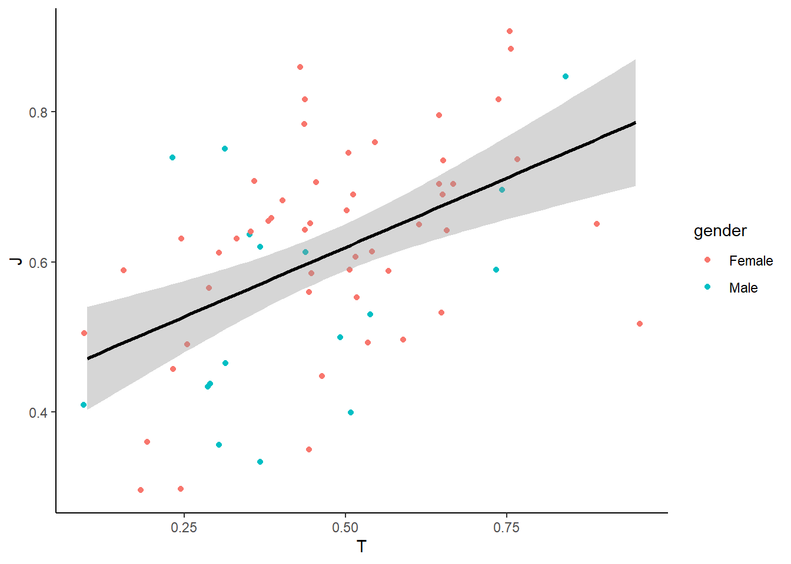

To show the linear regression results (R and p-value), we can use `stat_cor()` from the ggpubr package to display regression statistics.


``` r
library(ggpubr)

ggplot(MBTI) + 
  geom_jitter(aes(x = T, y = J, color = gender)) +  # Reduce overplotting
  geom_smooth(method = "lm", aes(x = T, y = J), color = "black") +  # Add a trendline
  stat_cor(aes(x = T, y = J)) +
  theme_classic()
```

```
## `geom_smooth()` using formula = 'y ~ x'
```

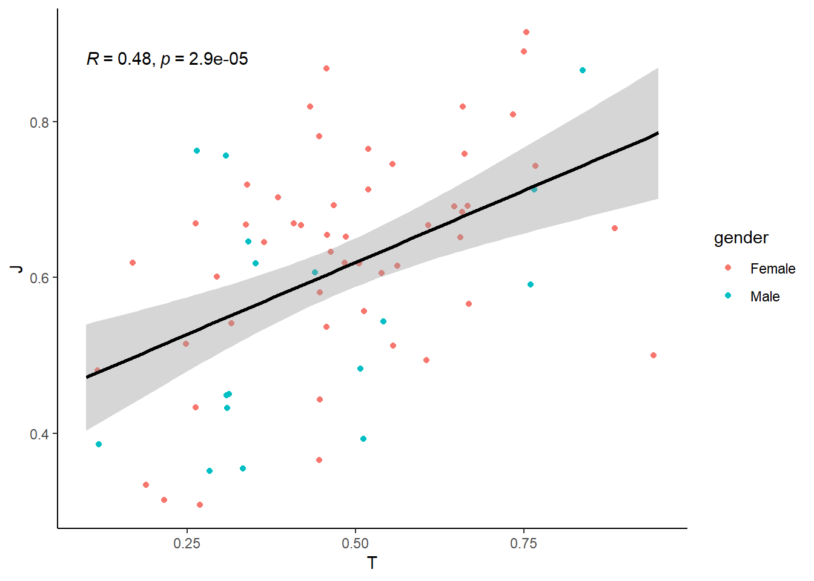

How do we interpret the results?

<details> <summary>**Click to see the answer.** </summary>

The R value (correlation coefficient) tells us how strongly two variables are related. An **R close to 1** indicates a **strong relationship**, meaning that as one variable increases, the other tends to increase as well. Conversely, an **R close to 0** suggests a **weak or no relationship**, meaning that changes in one variable do not reliably predict changes in the other. 

Typically:

- **R between 0.1 and 0.3** : **a weak relationship**
- **R between 0.3 and 0.6** : **a moderate relationship**
- **R above 0.6** : **a strong relationship** 

In the results above, an **R of 0.48** suggests a **moderate relationship** between Thinking Score (`T`) and Judging Score (`J`), meaning there is some association, but other factors likely contribute as well.

The **p-value** indicates whether the observed relationship is **statistically significant**. A p-value < 0.05 suggests that the relationship is unlikely to be due to random chance, while a higher p-value suggests weaker evidence for a meaningful relationship. In this case, **the p-value is 2.9e-05, which is much smaller than 0.05**, indicating that the relationship is statistically significant. However, a statistically significant result does not necessarily mean the relationship is strong or practically meaningful—R and the overall trend should also be considered to fully interpret the relationship.

You will learn more in detail about hypothesis testing and p values later.

</details>

To check the regression on the relationships in male vs female separately:


``` r
ggplot(MBTI) + 
  geom_jitter(aes(x = T, y = J, color = gender)) +  # Reduce overplotting
  geom_smooth(method = "lm", aes(x = T, y = J, color = gender)) +  # Add two trendlines
  stat_cor(aes(x = T, y = J, color = gender)) +
  theme_classic()
```

```
## `geom_smooth()` using formula = 'y ~ x'
```

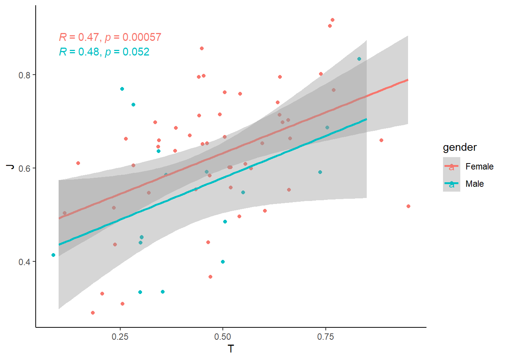

---

## **5.2 Relationship Between Two Categorical Variables**

---

When both variables are discrete/categorical, we are often interested in how their distributions compare. Instead of looking at individual counts separately, we want to see how one categorical variable is distributed within another.

For example, in our MBTI dataset, we might ask:

- Are extroversion/introversion different across genders?
- Do certain MBTI types tend to have specific blood types?

To explore the relationship effectively, we can use different types of visualizations:

- `Stacked Bar Chart` – Show the breakdown of one categorical variable within another
- `Grouped Bar Chart ` – Show the breakdown side-by-side

---

### **5.2.1 Stacked Bar Chart**


``` r
ggplot(MBTI) + 
  geom_bar(aes(x = gender, fill = EI)) + 
  theme_classic()
```

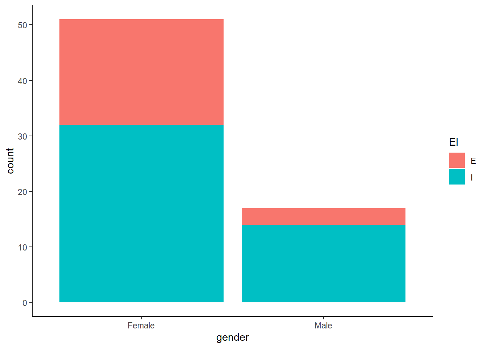

**Why use a stacked bar chart?**

- Helps visualize **proportions within each category**.
- Easy to compare total counts while seeing how groups contribute.

---

### **5.2.2 Grouped Bar Chart**

You just add `position = "dodge"` to the `geom_bar()` function.


``` r
ggplot(MBTI) + 
  geom_bar(aes(x = gender, fill = EI), position = "dodge") + 
  theme_classic()
```

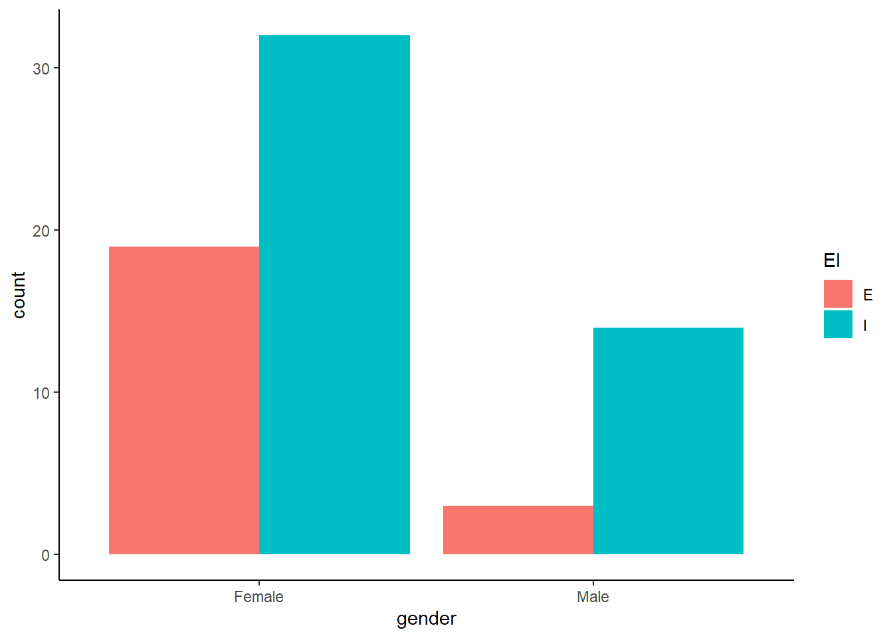

**Why use a grouped bar chart?**

- Makes it easier to **compare absolute counts across categories**.
- Avoids difficulty in interpreting stacked bar heights.

---

### **5.2.3 Mosaic Plot (`ggmosaic` package)**

A mosaic plot shows proportions for two categorical variables in a single chart. You need a separate 'ggmosaic' package though.


``` r
library(ggmosaic)

ggplot(data = MBTI) + 
  geom_mosaic(aes(x = product(gender), fill = EI)) + 
  theme_classic()
```

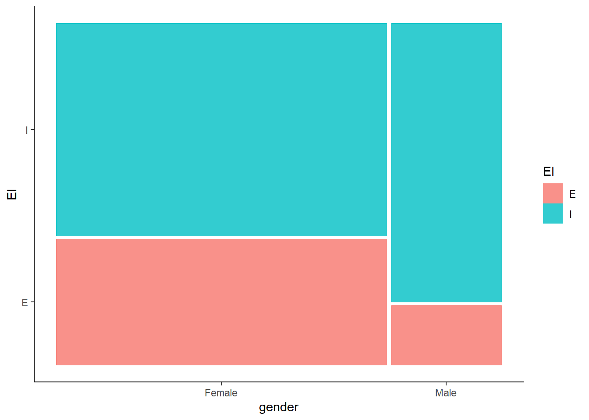

**Why use a mosaic plot?**

- **Shows proportions directly**, not just counts.
- The area of **each section is scaled to represent the data size**.

---

## **5.3 Relationship between a Continuous and a Categorical Variable**

---

When we analyze the relationship between one continuous variable and one categorical variable, we often want to compare **how the continuous variable varies across different categories**. Instead of treating all values as one distribution, we break them down by category to see differences more clearly.

For example, in our MBTI dataset, we might ask:

- How does screen time vary between extroverts/introverts?
- Do students with different genders have different average sleeping hours?

To visualize these relationships, we can use:

- `Box Plot`
- `Violin Plot`
- `Bar Chart` with Mean and Error Bars

---

### **5.3.1 Box Plot**

A box plot summarizes the distribution of a continuous variable across categories using quartiles.


``` r
ggplot(MBTI) +
  geom_boxplot(aes(x = EI, y = daily_screen_time)) +
  theme_classic()
```

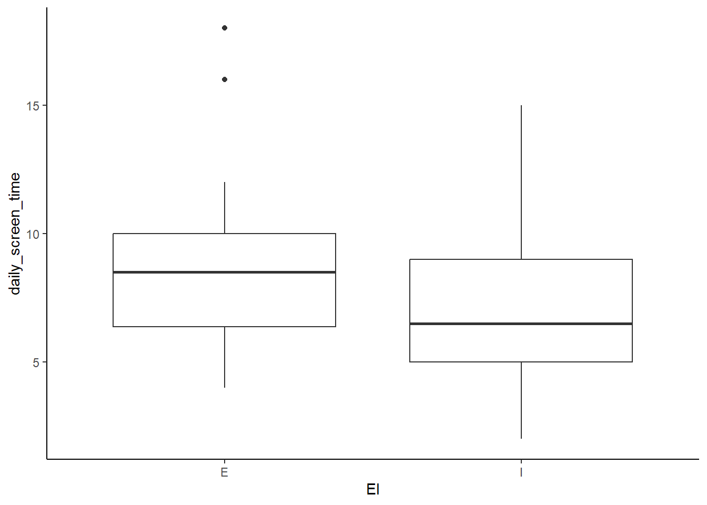

Make it more visually pleasing by coloring each group differently.


``` r
ggplot(MBTI) +
  geom_boxplot(aes(x = EI, y = daily_screen_time, fill = EI)) +
  theme_classic()
```

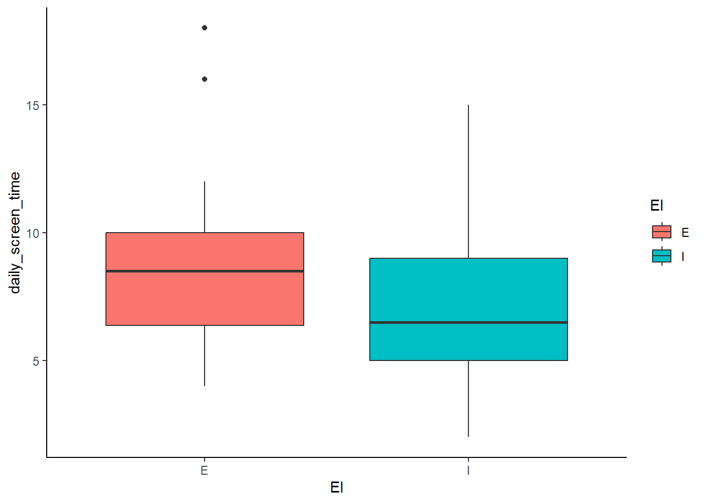

**Why use a box plot?**

- Shows **median**, **quartiles**, and **outliers** within each category.
- Helps compare **spread** and **variability** between groups.
- Easily identifies **outliers** that fall outside the usual range.

---

### **5.3.2 Violin Plot**

A violin plot is similar to a box plot but also shows the **full distribution shape**.


``` r
ggplot(MBTI) +
  geom_violin(aes(x = EI, y = daily_screen_time, fill = EI)) +
  theme_classic()
```

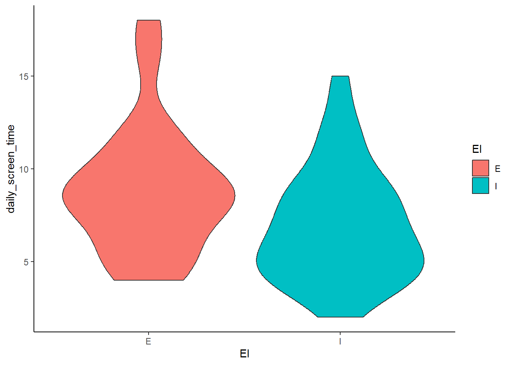

Show individual data points:


``` r
ggplot(MBTI) +
  geom_violin(aes(x = EI, y = daily_screen_time, fill = EI)) +
  geom_jitter(aes(x = EI, y = daily_screen_time)) +
  theme_classic()
```

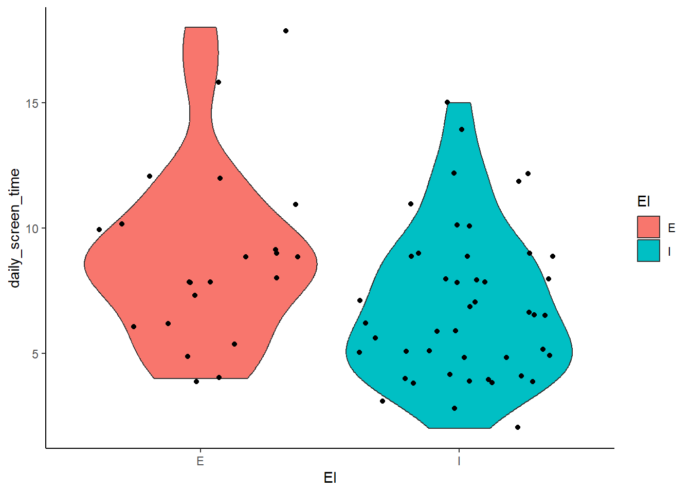

**Why use a violin plot?**

- Shows **density of the distribution** (where values are more concentrated).
- Helps compare **symmetry** vs. **skewness** between categories.
- Useful when data is **not normally distributed**.

---

### **5.3.3 Bar Chart with Mean and Error Bars**

Instead of plotting raw data, we can visualize summary statistics (e.g. mean ± standard deviation). Don't worry about this now. Just note that this is one of the common ways we visualize this type of relationship. You will learn about this in more detail in one of the later sessions where you manipulate the data first to get a new summarized dataframe to generate a plot.


``` r
ggplot(MBTI, aes(x = EI, y = daily_screen_time, fill = EI)) + 
  stat_summary(fun = mean, geom = "bar") + 
  stat_summary(fun.data = mean_cl_boot, geom = "errorbar", width = 0.2) +
  theme_classic()
```

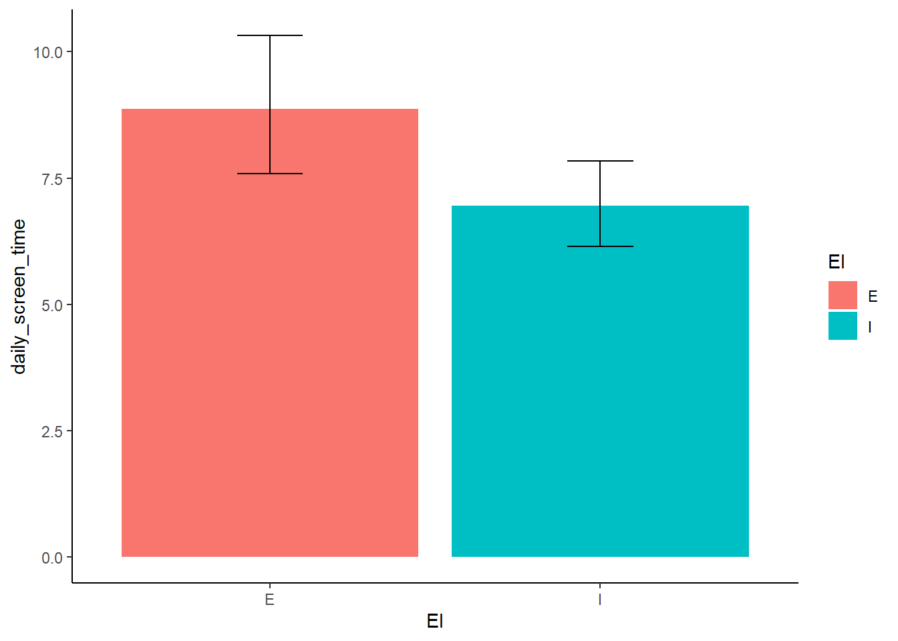

[Previous: 4. Visualizing a Discrete (Categorical) Variable](visualizing-a-discrete-categorical-variable.html)  
